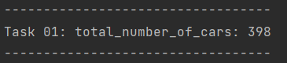
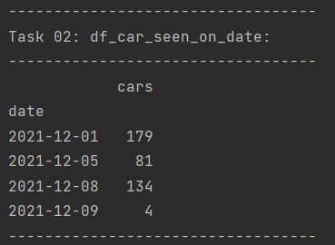
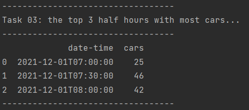
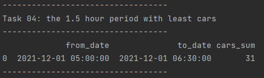

# Readme #

This is a Python scripts to make a program 'an automated traffic counter' for solving the tasks in the AIPS Coding Challenge.  
I used Python [pandas](https://pandas.pydata.org/) library for the tasks to solve since pandas is a fast, powerful, flexible and easy to use open source data analysis and manipulation tool, built on top of the Python programming language.

### How to run the program to get all the outputs? ###

* Please unpack zip file and open folder **'Code_challenge_monir-master'** as a project in any python IDE such as Pycharm.
* Please setup the python environment such as virtual environments and import pyhton libraries from requirement.txt file
* Run the python file **auto_traffic_counter.py** to get all the outputs. It has following five functions to generates the expected outputs. 
    * check_data: to make ready to manipulate. 
    * task01: generates the expected outputs for the number of cars seen in total
    
         
      
    * task02: generates the expected outputs for a sequence of lines where each line contains a date (in yyyy-mm-dd format) and the number of cars seen on that day (eg. 2016-11-23 289) for all days listed in the input file.
    
         
    
    * task03: generates the expected outputs for the the top 3 half hours with most cars, in the same format as the input file
    
      
    
    * task04: generates the expected outputs for the 1.5 hour period with least cars  
    
     

### How to tests the program? ###

* Run the python file **test_auto_traffic_counter.py** to get the tests the program:
* This checks the outputs generated from four functions (task01, task02, task03 and task04) of this program are correct.

### How to get data to run and test program? ###
* Data folder in the project directory has two csv files. 
* The file **traffic_data_ex1.csv** is actually the example file that was included on page 2 of the AIPS Coding Challenge.
* The file **traffic_data_ex2.csv** is extended version of data (adding more data see see the results variations).

_Developed by:_  
**Monir Moniruzzama**  
_Ontological Research Scientist_  
[SURROUND Australia Pty Ltd](https://surroundaustralia.com)  
<abm.mzkhan@surroundaustrlaia.com>
